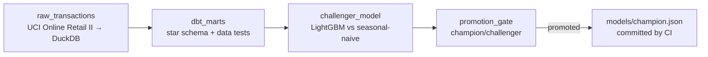

# retail-demand-platform

[](https://github.com/minhazda/retail-demand-platform/actions/workflows/ci.yml)
[](https://github.com/minhazda/retail-demand-platform/actions/workflows/retrain.yml)

An orchestrated demand-forecasting platform: what
[real-retail-forecasting](https://github.com/minhazda/real-retail-forecasting)
does as analysis, this repo runs as a **scheduled, tested, gated pipeline**.



Dagster assets orchestrate the graph; a GitHub Actions cron materializes it
every Monday on the real dataset (1M+ transactions).

## Design decisions

- **Data quality is a pipeline stage, not a hope.** `dbt build` runs the
  transforms *and* their tests (uniqueness of `(stock_code, invoice_date)`,
  accepted ranges, not-null) — a violation fails the materialization before
  training ever sees bad rows.
- **Retraining alone never ships a model.** The promotion gate compares the
  challenger's holdout MAE against the committed champion metrics
  (`models/champion.json`) and promotes only on a ≥1% improvement. The weekly
  workflow commits the new champion metrics, so the bar is versioned in git.
- **Leakage-safe features by construction.** Lags and rolling means are
  shifted before rolling and grouped per series; unit tests assert no future
  value or cross-series bleed reaches a training row.
- **Same cleaning rules as the analysis repo.** Staging drops cancellations,
  non-positive quantities/prices, and non-product stock codes — the decisions
  documented in real-retail-forecasting, now encoded as SQL + tests.
- **CI never depends on a flaky download.** The end-to-end CI run uses a
  synthetic dataset with real weekly seasonality; only the scheduled retrain
  touches the real source (mirror-first, UCI fallback, cached).
- **The feature logic scales past one machine — provably.**
  `spark_features.py` expresses the same leakage-safe lag/rolling features in
  PySpark's window API, and a parity suite pins both implementations to
  identical output (to 1e-9, including calendar gaps, the short-series
  cutoff, and pandas↔Spark day-of-week conventions). Honest framing: at this
  dataset's ~1M rows pandas wins on simplicity and speed — the Spark twin
  exists for the input size where that stops being true, and the parity test
  is what makes swapping it in safe. CI runs it on a real JVM per push.
- **Orchestrator concepts, not orchestrator lock-in.** The graph is Dagster
  assets here; [docs/dagster-to-airflow.md](docs/dagster-to-airflow.md) maps
  each asset onto its Airflow equivalent (DAG/task/dataset/sensor) — the
  design carries over even where the API doesn't.

## Run it

```bash
pip install -r requirements-dev.txt && pip install -e .
pytest -m "not pipeline"          # unit suite
(cd dbt_project && dbt deps --profiles-dir .)
pytest -m pipeline -s             # ingest → dbt build → train → gate, synthetic

dagster dev -m retail_platform.definitions   # asset graph UI at localhost:3000
dagster asset materialize --select "*" -m retail_platform.definitions  # real run
```

## Layout

| Path | What |
|---|---|
| `src/retail_platform/assets.py` | Dagster asset graph (ingest → dbt → train → gate) |
| `dbt_project/` | staging + marts SQL, sources, data tests (dbt-duckdb) |
| `src/retail_platform/training.py` | challenger training vs seasonal-naive baseline |
| `src/retail_platform/promotion.py` | champion/challenger gate |
| `src/retail_platform/spark_features.py` | PySpark twin of the feature frame, parity-tested against pandas |
| `.github/workflows/retrain.yml` | Monday cron: real data, artifact upload, champion commit |

Dataset: UCI Online Retail II (CC BY 4.0), fetched mirror-first for
reliability — see the provenance note in real-retail-forecasting.
